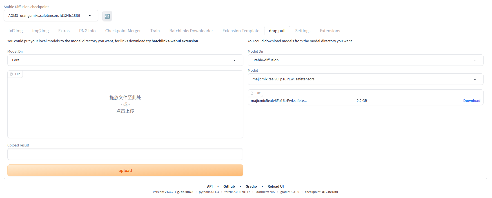

# upload-download-extension-for-A1111-webui
an extension for https://github.com/AUTOMATIC1111/stable-diffusion-webui used to upload or download models

## Use

Many users launch [A1111-webui](https://github.com/AUTOMATIC1111/stable-diffusion-webui) on cloud or notebook, and it's hard to upload or download models sometimes. Using this extension could make it easier.

## Install
1. install plugin from url 
   
   
2. restart ui 
   
   
3. switch to drag-pull tab 
   
   
